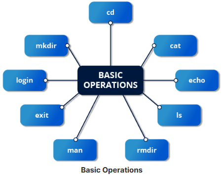

# Introduction to command line:

## Why command line?
* No GUI overhead is incurred.
* Virtually any and every task can be accomplished while sitting at the command line.
* You can implement scripts for often-used (or easy-to-forget) tasks and series of procedures.
* You can sign into remote machines anywhere on the Internet.
* You can initiate graphical applications directly from the command line instead of hunting through menus.
* While graphical tools may vary among Linux distributions, the command line interface does not.

To give **sudo** permissions to any user, follow below steps:
* First login as root user using `su` command.
* Then use following command to give sudo permissions to a user, lets say user is **test** user, then command will be:
  > `echo "test (ALL)=ALL ALL" > /etc/sudoers.d/test`
* Some linux distributions will require to give following permissions to this file as well:
  > `chmod 440 /etc/sudoers.d/test`
* Now logout the **root** user using `exit` command.
* To test if the permission is given or not, we can use following command and once prompted for password, provide the password of current user:
  >`sudo su`
* If it is successful, shell prompt will get changed to **#**.

## Virtual Terminal:
* While working on GUI, if at any point you are stuck, then VT (virtual terminal) is the way out.
* VT is a console session that uses the entire display and keyboard outside of a graphical environment. These are called virtual because there can be multiple VT active at the same time but we can only access one at a time.
* Usually there are 7 VT available. They can be accessed using **(CTRL+ALT+(F1-F7))**. F1 or F7 is usually reserved for graphical interface.

## Graphical Desktop:
* There are multiple ways to turn off or turn on graphical desktop in linux systems.
* In GNOME based systems, graphical desktop is running as a service named **gdm** we can change its status using `systemctl` utility.

## Basic Operations:

* `shutdown -h` to shutdown or halt the system
* `shutdown -r` to reboot the system
* `shutdown -c` to cancel the shutdown
* `shutdown -h hh:mm "System is shutting down for planned maintenance"` to inform multiple users logged into the current system about the planned system shutdown
* shutdown command required superuser privileges.

## Locating Applications:
* `which application_name`
* `whereis application_name`

## Accessing Directories:
* `pwd` to print current working directory
* `cd directory_name` to change directory
* `cd ..` to move up one directory
* `cd -` to change to previous working directory
* `popd` to change to previous working directory

## Creating Links:
* `ln file1 file2` to create hard links
* `ln -s file1 file2` to create soft links
* `ls -i` to print inode number of files
* `unlink link_name` to delete or remove the symbolic link

## Working with files:

### Viewing Files:
* `cat` to view files.
* `tac` to view files in reverse order, i.e. from last line.
* `less` to view large files, one page at a time.
* `tail` to view last 10 lines of a file, by default. By using **-n** switch we can specify number of lines to watch.
* `head` to view first 10 lines of a file, by default.

### Creating Files:
* `touch -t 12091600 myfile` to create a file in back date, 9th Dec 4 pm.
* `mv` to rename a file and to move a file.

## Changing Command Line Prompt:
* $PS1 holds the string which is displayed at the prompt.
* Usually the value is "[\u@\h \W] \$", where:
  * \u is for current user
  * \h is for current host
  * \W is for current working directory

## Standard File Streams: